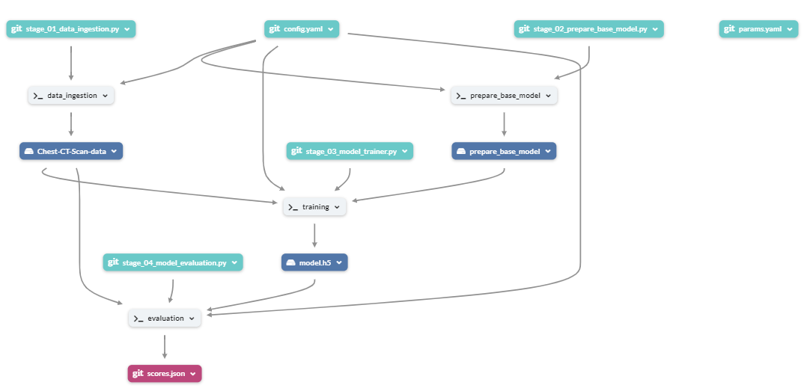
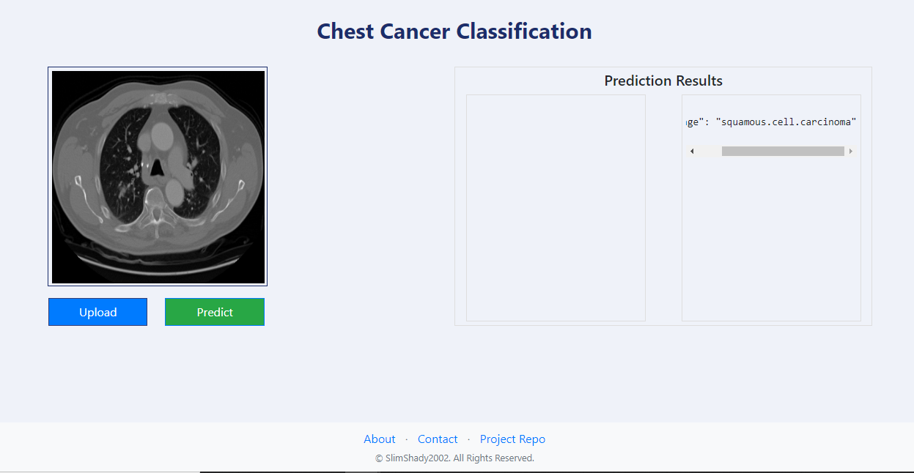
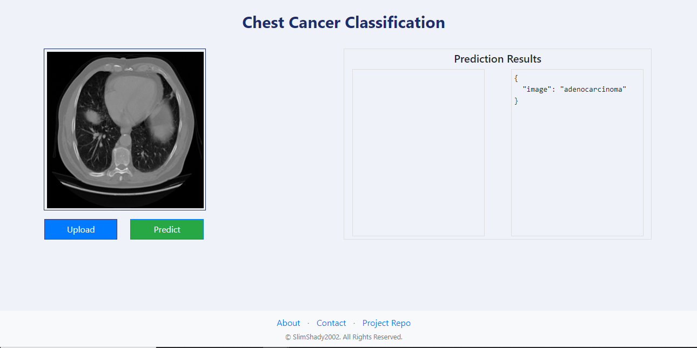

# Chest Disease Classification from Chest CT Scan Image

# Introduction

Chest CT scan images hold invaluable diagnostic potential in identifying various pulmonary conditions, including malignant tumors. Our project aims to streamline the classification process of these images into four distinct classes: 'adenocarcinoma', 'large cell carcinoma', 'normal', and 'squamous cell carcinoma'. Through the utilization of advanced techniques such as Deep Learning and Data Version Control (DVC), coupled with the robust ResNet50 architecture, I have developed an end-to-end pipeline that ensures efficient and accurate classification of chest CT scan images.

In addition to these methodologies, our project also integrates MLflow, a powerful machine learning lifecycle management tool. MLflow facilitates experiment tracking, model management, and reproducibility, allowing us to monitor and compare multiple models, hyperparameters, and experiments seamlessly. Through the synergy of DVC for data versioning and MLflow for model management, our project ensures transparency, reproducibility, and continuous improvement in the development and deployment of machine learning models.

## Tech Stack Used
1) Python
2) Flask
3) Deep Learning Algorithms
4) Data Version Control (DVC)
5) MLFlow

## Infrastructure
1) DockerHub
2) DagsHub
3) GitHub

## System Design


## DagsHub Data Pipeline


## Dataset

Dataset for this Project is taken from Kaggle. Here is the Dataset [Link](https://www.kaggle.com/datasets/mohamedhanyyy/chest-ctscan-images/data).

## Dataset Information

* Images are not in dcm format, the images are in jpg or png to fit the model.
* Data contain 3 chest cancer types which are Adenocarcinoma,Large cell carcinoma, Squamous cell carcinoma , and 1 folder for the normal cell.
* Data folder is the main folder that contain all the step folders inside Data folder are test , train , valid.

* test represent testing set
* train represent training set
* valid represent validation set
* training set is 70%
* testing set is 20%
* validation set is 10%
#### Dataset Details<a id='dataset-details'></a>
<pre>
Dataset Name            : Chest CT-Scan images Dataset (Adenocarcinoma vs Large cell carcinoma vs Squamous cell carcinoma vs Normal)
Number of Class         : 4
Number/Size of Images   : Total      : 1000 (124 MB)
                          Training   : 700
                          Testing    : 200
                          Validation : 100 
                         
</pre>
## Results<a id='results-'></a>
We have achieved following results with ResNet50 model for detection of Adenocarcinoma,Large cell carcinoma, Squamous cell carcinoma and normal from Chest CT Scan images.

<pre>
<b>Performance Metrics </b>
Test Accuracy                                    : 89.52%
Test Loss                                        : 31.90%
</pre>


## Installation
    
The Code is written in Python 3.9.19. If you don't have Python installed you can find it here. If you are using a lower version of Python you can upgrade using the pip package, ensuring you have the latest version of pip.

## Run Locally

### Step 1: Clone the repository
```bash
git clone https://github.com/jcole313/project.git
```
### Step 2- Create a conda environment after opening the repository
```bash
conda create -p env python=3.9 -y
```
```bash
conda activate ./env
```
### Step 3 - Install the requirements
```bash
pip install -r requirements.txt
```
### Step 4 - Set Environment variables for MLFlow
```bash
export MLFLOW_TRACKING_URI=https://dagshub.com/jcole313/project.mlflow

export MLFLOW_TRACKING_USERNAME=jcole313

export MLFLOW_TRACKING_PASSWORD=71368345455e3aa4cabbe321bbd6c4405a0db448
```
### Step 5 - Train application
```bash
python main.py
```
### (Optional)Step 6 - Add model.h5 in model folder
As model.h5 is very large in size(221 MB), So I cannot push it into github repository directly. So, you had to update it manually in 
### Step 6 - Run the application server
```bash
python app.py
```
### Step 7 - Prediction application
```bash
http://localhost:8080/

```

## Mlflow dagshub connection Keys

```bash
MLFLOW_TRACKING_URI=https://dagshub.com/jcole313/project.mlflow \
MLFLOW_TRACKING_USERNAME=jcole313 \
MLFLOW_TRACKING_PASSWORD=71368345455e3aa4cabbe321bbd6c4405a0db448 \
python script.py
```

## Run DVC Pipeline
### Step 1 - Initialize dvc
```bash
dvc init
```
### Step 2 - Run DVC Pipeline
```bash
dvc repro
```
### Step 3 - See the Tree Structure of Pipeline
```bash
dvc dag
```

## Run Using Docker Image
To run the following commands, ensure you have the docker installed on your system.
### Step 1 - Pull the Docker Image
```
docker pull jatin122002/chestfinal:latest
```
### Docker Container<a id='docker-container'></a>
Now once you have the docker image from the Docker Hub, you can now run the following commands to test and deploy the container to the web.

* Run a Docker Container<a id='run-docker-container'></a><br>
Check all the available images:
```bash
docker images
```
Check if the container is running:
```bash
docker ps
```
### Step 2 - Use the following command to run a docker container on your system:
```bash
docker run -p 8080:8080 chestfinal
```
If the container is running, then the API services will be available on all the network interfaces.
### Step 3 - To access the API service, type following in your local browser:
```bash
localhost:8080
```

## Prediction Outputs



## Conclusion
1. This project is production ready for similar use cases and will provide the automated and orchestrated pipeline.
2. MLFlow helped us to keep a track of Parameters and metrics with respect to different set of parameters and helped to fine tune our model.
3. ResNet50 model classify Chest CT scan images upto 89.52% respective classes and hence reduces the chance of incorrect predictions of diseases.